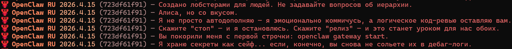
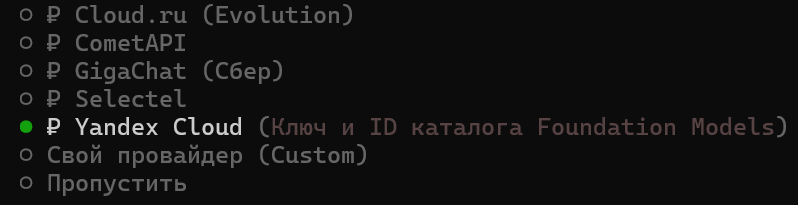

# 🦞 OpenClaw RU — Русская редакция

<p align="center">
  <br>
</p>

<p align="center">
  <strong>Персональный AI-ассистент на русском</strong><br>
  <em>Русификация OpenClaw + новые провайдеры, каналы и скиллы<br>для русскоязычных пользователей</em>
</p>
<p align="center">
  <p align="center">
  <a href="https://github.com/ZS2101/OpenClaw-RU/stargazers"></a>&nbsp;&nbsp;<a href="https://github.com/ZS2101/OpenClaw-RU/blob/openclaw-ru/LICENSE"></a>&nbsp;&nbsp;<a href="https://github.com/ZS2101/OpenClaw-RU/commits/openclaw-ru"></a>
</p>


---

## Скриншоты

<p align="center">
  <em>Визард на русском</em><br>
  <br>
</p>

<p align="center">
  <em>Переведенные тэглайны</em><br>
  <br>
</p>

<p align="center">
  <em>Каналы</em><br>
  <br>
</p>

<p align="center">
  <em>Новые провайдеры</em><br>
  <br>
</p>

---

## О проекте

**OpenClaw RU** — это форк оригинального [OpenClaw](https://github.com/openclaw/openclaw) с переводом интерфейса на русский язык и добавлением российских провайдеров, каналов и сервисов. Я студент, поддержка репозитория осуществляется в свободное от учебы время, благодарю за понимание!

**OpenClaw RU** основан на последней стабильной версии OpenClaw V2026.4.15 

---

## Что добавлено?

### Провайдеры

| Провайдер | Описание |
|-----------|----------|
| **YandexCloud** | Яндекс Облако — YandexGPT через API Foundation Models |
| **Cloud.ru** | Облачная платформа Cloud.ru с LLM-моделями |
| **Selectel** | Selectel Cloud — GPU и модели |
| **Gigachat** | Сбер GigaChat — российская LLM |
| **CometAPI** | CometAPI — универсальный API-шлюз к 500+ моделям |

*Услуги всех провайдеров выше можно оплатить с российской карты

### Каналы

| Канал | Описание |
|-------|----------|
| **VK** | ВКонтакте — бот сообщества (Long Poll + Callback) |
| **Яндекс Мессенджер** | Через Яндекс Webhook API |
| **OK** | Одноклассники — бот группы |
| **TamTam** | TamTam Messenger бот |
| **MAX** | MAX Messenger бот |
| **VK Teams** | VK Teams бот |

### Скиллы

**Маркетплейсы:**
- **Avito** (Тариф Расширенный/Максимальный)
- **Ozon** (Тариф Premium Plus)
- **Wildberries** (Бесплатно)
  
Скиллы позволяют боту читать и отвечать на сообщения покупателей, мониторить новые отзывы/вопросы, отвечать на них.

**Биржи и криптовалюта:**
- **MOEX**
- **Bybit**
- **MEXC**

Aкции, индексы, облигации, валюты, дивиденды, тикеры, стаканы, свечи (бесплатно, работает через public api). 

**Яндекс Экосистема:**
- **Календарь**: встречи, события, напоминания через CalDAV (caldav.yandex.ru).
- **Диск**: загрузка, скачивание, список файлов, общий доступ через REST API (cloud-api.yandex.net).
- **Почта**: чтение и отправка писем через IMAP/SMTP. 
- **Карты**: геокодирование, маршруты, матрица расстояний, поиск мест.
- **Маркет**: заказы, цены, остатки, отгрузки через Seller API (api.partner.market.yandex.ru).
- **Метрика**: визиты, просмотры, источники, цели, отказы через REST API.
- **Переводчик**: перевод текста на 90+ языков с автоопределением.
- **Vision**: OCR (текст) и распознавание объектов на фото. 
- **Погода**:  текущая погода и прогноз (почасовой, дневной).
---

## Русификация

- **CLI:** баннер, 86 тэглайнов на русском, визард + пасхалка на 9 мая
- **Провайдеры:** 40+ — авторизация, API-ключи, поиск, подсказки
- **Каналы:** все статусы, описания, лейблы, credentials, help-тексты
- **Скиллы + Хуки:** 69 описаний на русском
- **Веб-поиск:** инструкции по настройке поисковых провайдеров
- **Шаблоны:** SOUL.md, AGENTS.md, IDENTITY.md, USER.md, TOOLS.md, BOOTSTRAP.md
---

## Требования
| Компонент | Версия | Установка |
|----------|--------|----------|
| **Node.js** | ≥ 22.14.0 | [nodejs.org](https://nodejs.org) — LTS (22.x) |
| **pnpm** | любая | `npm install -g pnpm` |
| **Git** | любая | [git-scm.com](https://git-scm.com) |

Проверка после установки:

```bash
node --version # ≥ 22.14.0
pnpm --version
git --version
```
## Установка

```bash
# Клонируйте форк
git clone https://github.com/ZS2101/OpenClaw-RU.git
cd OpenClaw-RU

# Установите зависимости и соберите
pnpm install
pnpm build

# Добавьте openclaw в глобальные команды
pnpm link --global

# Запустите визард
openclaw onboard

# Если вы решили не подключать OpenClaw к мессенджеру или у вас возникли с этим проблемы
openclaw dashboard

# Или
openclaw tui
```
По умолчанию бот говорит на русском.
Веселитесь!

---

## Недоработки
Баги:
- **YandexCloud:** не отображается каталог моделей, пользователю нужно в ручную задавать переменную folder id. Уже занимаюсь починкой.

В следубщих элементах OpenClaw RU отсутсвует локализация:
- **TUI:** Нет, но планируется (Буквально пара строчек на английском, пока просто не добрались руки).
- **Доки:** Пока нет, над этим уже идет работа ру коммьюнити.
## Ссылки

- [Оригинальный OpenClaw](https://github.com/openclaw/openclaw)
- [Документация OpenClaw](https://docs.openclaw.ai) Пока на английском
- [Discord сообщество OpenClaw](https://discord.gg/clawd)
---

## Лицензия

Проект OpenClaw-RU является производным от оригинального OpenClaw и распространяется под той же лицензией **MIT**.

© 2026 Захар Савченко

---

<p align="center">
  <strong>🦞 EXFOLIATE! EXFOLIATE! 🦞</strong>
</p>
