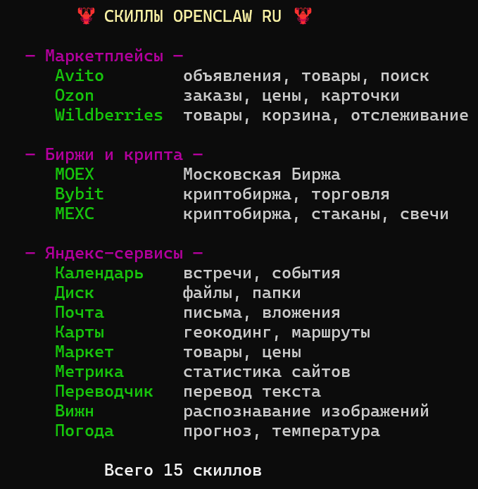

# 🦞 OpenClaw RU — Русская редакция

<p align="center">
  <br>
</p>

<p align="center">
  <strong>Персональный AI-ассистент на русском</strong><br>
  <em>Полная русификация OpenClaw + новые провайдеры, каналы и скиллы<br>для русскоязычных пользователей и локального AI</em>
</p>
<p align="center">
  <a href="https://github.com/ZS2101/OpenClaw-RU/stargazers">
    
  </a>
  <a href="https://github.com/ZS2101/OpenClaw-RU/blob/openclaw-ru/LICENSE">
    
  </a>
  <a href="https://github.com/ZS2101/OpenClaw-RU/commits/openclaw-ru">
    
  </a>
</p>

---

## Скриншоты

<p align="center">
  <em>Визард на русском</em><br>
  <br>
</p>

<p align="center">
  <em>Каналы</em><br>
  <br>
</p>

<p align="center">
  <em>Скиллы</em><br>
  <br>
</p>

---

## Введение

**OpenClaw RU** — это форк оригинального [OpenClaw](https://github.com/openclaw/openclaw) с полным переводом интерфейса на русский язык и добавлением российских провайдеров, каналов и сервисов.

Проект основан на V2026.4.15 OpenClaw (все билды оригинального OpenClaw после данной версии поломаны).

---

## Что добавлено?

### Провайдеры

| Провайдер | Описание |
|-----------|----------|
| **YandexCloud** | Яндекс Облако — YandexGPT через API Foundation Models |
| **Cloud.ru** | Облачная платформа Cloud.ru с LLM-моделями |
| **Selectel** | Selectel Cloud — GPU и модели |
| **Gigachat** | Сбер GigaChat — российская LLM |
| **CometAPI** | CometAPI — универсальный API-шлюз к 500+ моделям |

*Услуги всех провайдеров выше можно оплатить с российской карты

### Каналы

| Канал | Описание |
|-------|----------|
| **VK** | ВКонтакте — бот сообщества (Long Poll + Callback) |
| **Яндекс Мессенджер** | Через Яндекс Webhook API |
| **OK** | Одноклассники — бот группы |
| **TamTam** | TamTam Messenger бот |
| **MAX** | MAX Messenger бот |
| **VK Teams** | VK Teams бот |

### Скиллы

**Маркетплейсы:**
- Avito: чаты с покупателями, отзывы, рейтинг через REST API (api.avito.ru). Для работы нужна подписка.
- Ozon: чаты с покупателями, отзывы, рейтинг через Seller API (api-seller.ozon.ru). Для работы нужна подписка Premium Plus.
- Wildberries: чаты, отзывы, вопросы покупателей через Seller API. Бесплатно для всех продавцов

**Биржи и криптовалюта:**
- MOEX, Bybit, MEXC

**Сервисы Яндекс:**
- Календарь, Диск, Почта, Карты, Маркет, Метрика, Переводчик, Вижн, Погода

---

## Полная русификация

- **CLI:** баннер `OPENCLAW RU`, 86 тэглайнов на русском, визард + пасхалка на 9 мая
- **Провайдеры:** 40+ — авторизация, API-ключи, поиск, подсказки
- **Каналы:** все статусы, описания, лейблы, credentials, help-тексты
- **Скиллы:** 65 описаний на русском
- **Хуки:** 4 описания
- **Веб-поиск:** вся настройка поисковых провайдеров
- **Шаблоны:** SOUL.md с языковой инструкцией (бот говорит на русском), AGENTS.md, IDENTITY.md, USER.md, TOOLS.md, BOOTSTRAP.md

---

## Установка

```bash
# Клонируйте форк
git clone https://github.com/ZS2101/OpenClaw-RU.git
cd OpenClaw-RU

# Установите зависимости и соберите
npm install
npm run build

# Запустите визард
openclaw onboard
```
После `openclaw onboard` бот заговорит с вами на русском — шаблоны SOUL.md и AGENTS.md уже на русском, с инструкцией говорить по-русски по умолчанию.

---

## Ссылки

- [Оригинальный OpenClaw](https://github.com/openclaw/openclaw)
- [Документация OpenClaw](https://docs.openclaw.ai)
- [Discord сообщество OpenClaw](https://discord.gg/clawd)
---

## Лицензия

MIT

---

<p align="center">
  <strong>🦞 EXFOLIATE! СДЕЛАНО С ЛЮБОВЬЮ К РУССКОМУ AI 🦞</strong>
</p>
